---
## Front matter
lang: ru-RU
title: Лабораторная работа №1
subtitle: Работа с git
author:
  - Аскеров А.Э.
institute:
  - Российский университет дружбы народов, Москва, Россия
date: 22 февраля 2025

## i18n babel
babel-lang: russian
babel-otherlangs: english

## Formatting pdf
toc: false
toc-title: Содержание
slide_level: 2
aspectratio: 169
section-titles: true
theme: metropolis
header-includes:
 - \metroset{progressbar=frametitle,sectionpage=progressbar,numbering=fraction}
---

# Вводная часть

## Цель работы

Приобрести практические навыки работы с системой управления версиями Git.

## Задание

Изучить работу Git.

# Выполнение лабораторной работы

## Подготовка

### Установка имени и электронной почты

В случае если ранее git не использовался, для начала нам необходимо осуществить установку. Выполним следующие команды, чтобы git узнал наше имя и электронную почту.

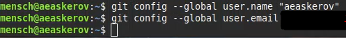{#fig:001 width=70%}

### Параметры установки окончаний строк

Укажем параметры установки окончаний строк со значениями true и input.

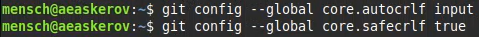{#fig:002 width=70%}

## Подготовка

### Установка отображения unicode

Установим соответствующий флаг, чтобы избежать нечитаемых строк.

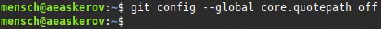{#fig:003 width=70%}

## Создание проекта

### Создадим страницу «Hello World»

Начнём работу в пустом рабочем каталоге с создания пустого каталога с именем hello, затем войдём в него и создадим там файл с именем hello.html.

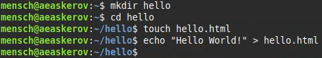{#fig:004 width=70%}

## Создание проекта

### Создание репозитория

Чтобы создать git репозиторий из этого каталога, выполним команду git init.

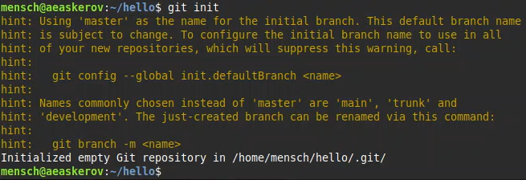{#fig:005 width=70%}

## Создание проекта

### Добавление файла в репозиторий

Добавим файл в репозиторий.

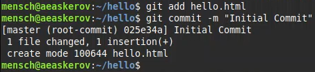{#fig:006 width=70%}

## Создание проекта

### Проверка состояния репозитория

Проверим текущее состояние репозитория.

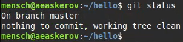{#fig:007 width=70%}

Видим, что коммитить нечего – в репозитории хранится текущее состояние рабочего каталога, и нет никаких изменений, ожидающих записи.

## Внесение изменений

### Изменим страницу «Hello World»

Добавим кое-какие HTML-теги к нашему приветствию. Изменим содержимое файла hello.html на следующее.

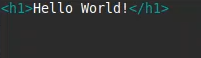{#fig:008 width=15%}

## Внесение изменений

Проверим состояние рабочего каталога.

{#fig:009 width=50%}

Видно, что git знает, что файл hello.html был изменён, но при этом эти изменения ещё не зафиксированы в репозитории.

## Индексация изменений

Теперь выполним команду git, чтобы проиндексировать изменения. Проверим состояние.

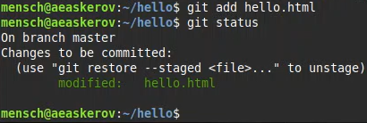{#fig:010 width=60%}

Изменения файла hello.html были проиндексированы. Это означает, что git теперь знает об изменении, но изменение пока не записано в репозиторий. Следующий коммит будет включать в себя проиндексированные изменения.

## Индексация изменений

### Коммит изменений

Сделаем коммит и проверим состояние.

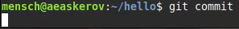{#fig:011 width=40%}

Откроется редактор.

В первой строке введём комментарий: «Added h1 tag». Сохраним файл и выйдем из редактора.

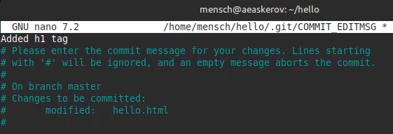{#fig:012 width=50%}

## Индексация изменений

Теперь ещё раз проверим состояние.

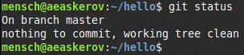{#fig:013 width=50%}

Рабочий каталог чистый, можно продолжить работу.

## Индексация изменений

### Добавим стандартные теги страницы

Изменим страницу «Hello World», чтобы она содержала стандартные теги html и body.

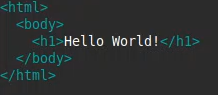{#fig:014 width=40%}

## Индексация изменений

Теперь добавим это изменение в индекс git.

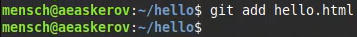{#fig:015 width=70%}

Теперь добавим заголовки HTML (секцию head) к странице «Hello World».

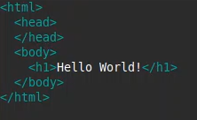{#fig:016 width=30%}

## Индексация изменений

Проверим текущий статус.

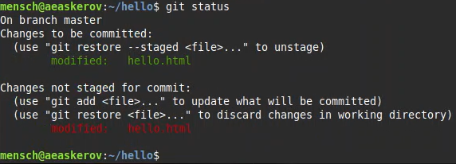{#fig:017 width=70%}

## Индексация изменений

Обратим внимание на то, что hello.html указан дважды в состоянии. Первое изменение (добавление стандартных тегов) проиндексировано и готово к коммиту. Второе изменение (добавление заголовков HTML) является непроиндексированным. Если бы мы делали коммит сейчас, заголовки не были бы сохранены в репозиторий.

## Индексация изменений

Произведём коммит проиндексированного изменения (значение по умолчанию), а затем ещё раз проверим состояние.

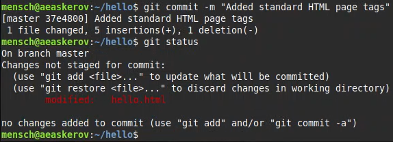{#fig:018 width=70%}

Состояние команды говорит о том, что hello.html имеет незафиксированные изменения, но уже не в буферной зоне.

## Индексация изменений

Теперь добавим второе изменение в индекс, а затем проверим состояние с помощью команды git status.

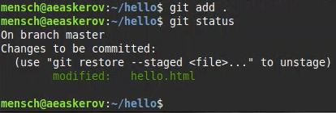{#fig:019 width=50%}

Второе изменение проиндексировано и готово к коммиту.

## Индексация изменений

Сделаем коммит второго изменения.

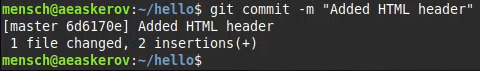{#fig:020 width=70%}

## Индексация изменений

### История

Получим список произведённых изменений.

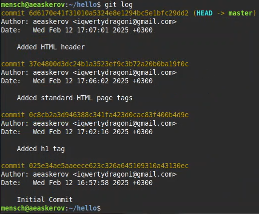{#fig:021 width=50%}

## Индексация изменений

### Получение старых версий

Команда checkout позволяет вернуться назад в истории – она копирует любой снимок из репозитория в рабочий каталог.

Получим хэши предыдущих версий.

## Индексация изменений

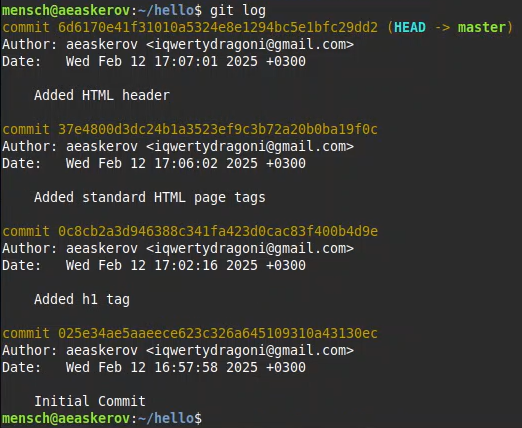{#fig:022 width=50%}

## Индексация изменений

Изучим данные лога и найдём хэш для первого коммита. Он должен быть в последней строке данных. Используем этот хэш-код (достаточно первых 7 знаков) в команде ниже. 
Затем проверим содержимое файла hello.html.

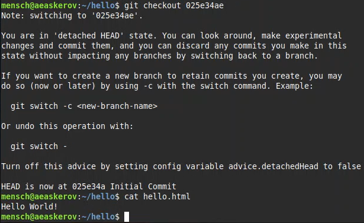{#fig:023 width=40%}

## Индексация изменений

Вернёмся к последней версии в ветке master.

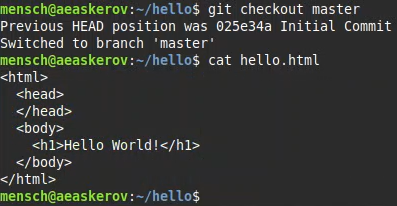{#fig:024 width=40%}

master – имя ветки по умолчанию. Переключая имена веток, мы попадаем на последнюю версию выбранной ветки.

## Индексация изменений

### Создание тегов версий

Назовём текущую версию страницы hello первой (v1).

Создадим тег первой версии.

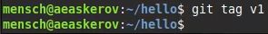{#fig:025 width=30%}

Теперь текущая версия страницы называется v1.

После этого создадим тег для версии, которая идёт перед текущей версией и назовем её v1-beta. В первую очередь нам надо переключиться на предыдущую версию.

## Индексация изменений

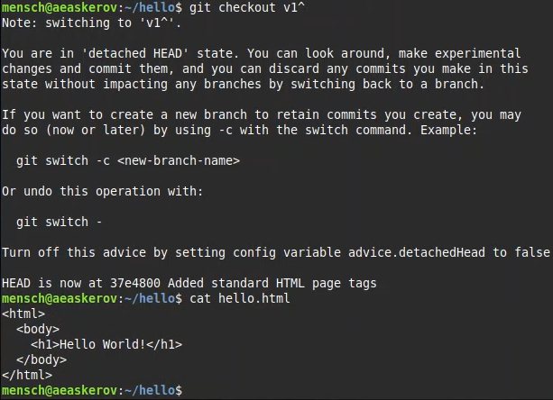{#fig:026 width=40%}

Это версия c тегами html и body, но ещё пока без head. Давайте сделаем её версией v1-beta.

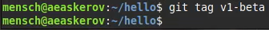{#fig:027 width=40%}

## Индексация изменений

### Переключение по имени тега

Теперь попробуем попереключаться между двумя отмеченными версиями.

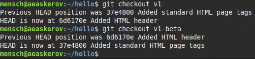{#fig:028 width=70%}

## Индексация изменений

### Просмотр тегов с помощью команды tag

Мы можем увидеть, какие теги доступны, используя команду git tag.

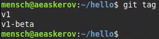{#fig:029 width=30%}

Мы также можем посмотреть теги в логе.

## Индексация изменений

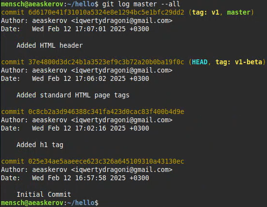{#fig:030 width=40%}

## Отмена локальных изменений (до индексации)

### Переключимся на ветку master

Убедимся, что мы находимся на последнем коммите ветки master, прежде чем продолжить работу.

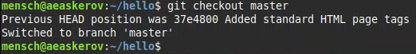{#fig:031 width=70%}

## Отмена локальных изменений (до индексации)

### Изменим hello.html

Иногда случается, что мы изменили файл в рабочем каталоге, и хотим отменить последние коммиты. С этим справится команда git checkout.

Внесём изменение в файл hello.html в виде нежелательного комментария.

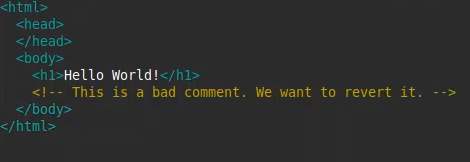{#fig:032 width=70%}

## Отмена локальных изменений (до индексации)

### Проверим состояние

Сначала проверим состояние рабочего каталога.

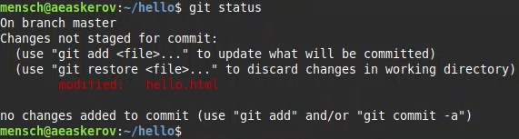{#fig:033 width=70%}

Мы видим, что файл hello.html был изменен, но еще не проиндексирован.

## Отмена локальных изменений (до индексации)

### Отмена изменений в рабочем каталоге

Используем команду git checkout для переключения версии файла hello.html в репозитории.

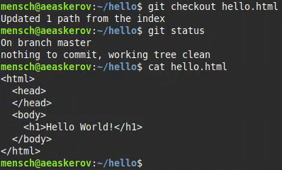{#fig:034 width=32%}

Команда git status показывает нам, что не было произведено никаких изменений, не зафиксированных в рабочем каталоге.

## Отмена проиндексированных изменений (перед коммитом)

### Изменим файл и проиндексируем изменения

Внесём изменение в файл hello.html в виде нежелательного комментария.

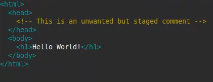{#fig:035 width=50%}

## Отмена проиндексированных изменений (перед коммитом)

Проиндексируем это изменение.

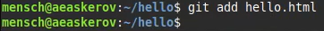{#fig:036 width=70%}

## Отмена проиндексированных изменений (перед коммитом)

### Проверим состояние

Проверим состояние нежелательного изменения.

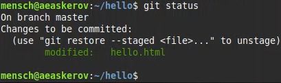{#fig:037 width=70%}

Состояние показывает, что изменение было проиндексировано и готово к коммиту.

## Отмена проиндексированных изменений (перед коммитом)

### Выполним сброс буферной зоны

К счастью, вывод состояния показывает нам именно то, что мы должны сделать для отмены индексации изменения.

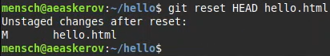{#fig:038 width=70%}

Команда git reset сбрасывает буферную зону к HEAD. Это очищает буферную зону от изменений, которые мы только что проиндексировали.

## Отмена проиндексированных изменений (перед коммитом)

### Переключимся на версию коммита

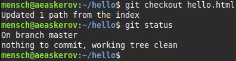{#fig:039 width=70%}

Наш рабочий каталог опять чист.

## Отмена коммитов

### Отмена коммитов

Иногда мы понимаем, что новые коммиты являются неверными, и хотим их отменить. Есть несколько способов решения этого вопроса, здесь мы будем использовать самый безопасный. Мы отменим коммит путём создания нового коммита, отменяющего нежелательные изменения.

## Отмена коммитов

### Изменим файл и сделаем коммит

Изменим файл hello.html на следующий.

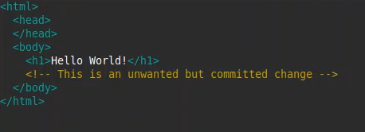{#fig:040 width=50%}

## Отмена коммитов

Выполним следующие команды.

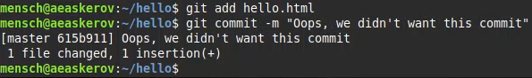{#fig:041 width=50%}

## Отмена коммитов

### Сделаем коммит с новыми изменениями, отменяющими предыдущие

Чтобы отменить коммит, нам необходимо сделать коммит, который удаляет изменения, сохранённые нежелательным коммитом.

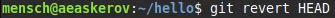{#fig:042 width=25%}

Перейдём в редактор, где мы можем отредактировать коммит-сообщение по умолчанию или оставить все как есть. Сохраним и закроем файл.

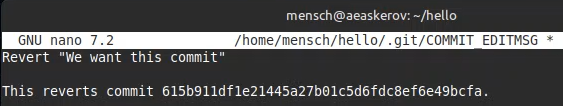{#fig:043 width=60%}

## Отмена коммитов

### Проверим лог

Проверка лога показывает нежелательные и отменённые коммиты в наш репозиторий.

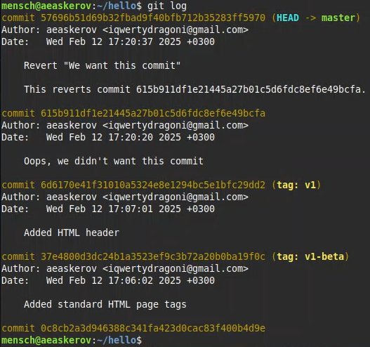{#fig:044 width=50%}

## Удаление коммитов из ветки

git revert является мощной командой, которая позволяет отменить любые коммиты в репозиторий. Однако, и оригинальный и «отменённый» коммиты видны в истории ветки (при использовании команды git log).

Часто мы делаем коммит, и сразу понимаем, что это была ошибка. Было бы неплохо иметь команду «возврата», которая позволила бы нам сделать вид, что неправильного коммита никогда и не было. Команда «возврата» даже предотвратила бы появление нежелательного коммита в истории git log.

## Удаление коммитов из ветки

### Команда git reset

При получении ссылки на коммит (т.е. хэш, ветка или имя тега), команда git reset:

- перепишет текущую ветку, чтобы она указывала на нужный коммит;
- опционально сбросит буферную зону для соответствия с указанным коммитом;
- опционально сбросит рабочий каталог для соответствия с указанным коммитом.

## Удаление коммитов из ветки

### Проверим нашу историю

Давайте сделаем быструю проверку нашей истории коммитов. Выполним следующее.

## Удаление коммитов из ветки

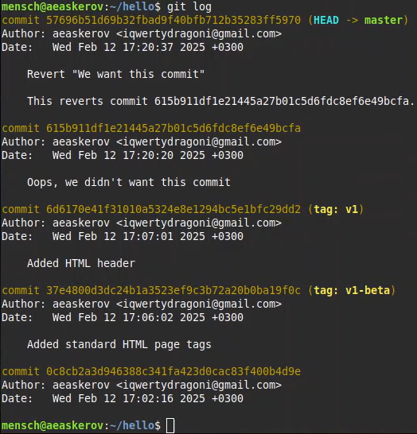{#fig:045 width=50%}

## Удаление коммитов из ветки

Мы видим, что два последних коммита в этой ветке – «Oops» и «Revert Oops». Удалим их с помощью сброса.

## Удаление коммитов из ветки

### Для начала отметим эту ветку

Но прежде чем удалить коммиты, отметим последний коммит тегом, чтобы потом можно было его найти.

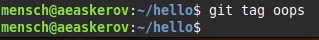{#fig:046 width=50%}

## Удаление коммитов из ветки

### Сброс коммитов к предшествующим коммиту Oops

Глядя на историю лога, мы видим, что коммит с тегом «v1» является коммитом, предшествующим ошибочному коммиту. Сбросим ветку до этой точки. Поскольку ветка имеет тег, мы можем использовать имя тега в команде сброса (если она не имеет тега, мы можем использовать хэш-значение).

## Удаление коммитов из ветки

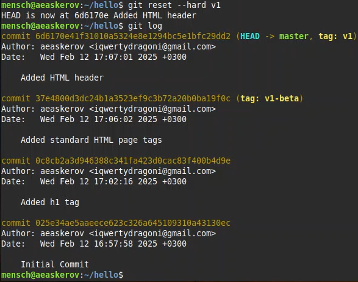{#fig:047 width=50%}

## Удаление коммитов из ветки

Наша ветка master теперь указывает на коммит v1, а коммитов Oops и Revert Oops в ветке уже нет. Параметр --hard указывает, что рабочий каталог должен быть обновлен в соответствии с новым head ветки.

## Удаление коммитов из ветки

### Ничего никогда не теряется

Что же случается с ошибочными коммитами? Оказывается, что коммиты всё ещё находятся в репозитории. На самом деле, мы всё ещё можем на них ссылаться. Например, в начале этого урока мы создали для отменённого коммита тег «oops». Посмотрим на все коммиты.

## Удаление коммитов из ветки

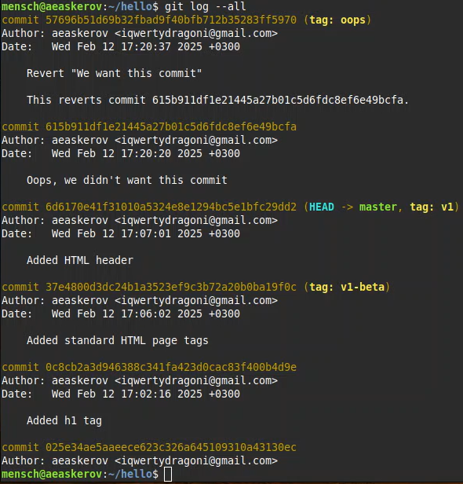{#fig:048 width=50%}

## Удаление коммитов из ветки

Мы видим, что ошибочные коммиты не исчезли. Они всё ещё находятся в репозитории. Просто они отсутствуют в ветке master. Если бы мы не отметили их тегами, они по-прежнему находились бы в репозитории, но не было бы никакой возможности ссылаться на них, кроме как при помощи их хэш-имён. Коммиты, на которые нет ссылок, остаются в репозитории до тех пор, пока не будет запущен сборщик мусора.

## Удаление коммитов из ветки

### Опасность сброса

Сброс в локальных ветках, как правило, безопасен. Последствия любой «аварии» как правило, можно восстановить простым сбросом с помощью нужного коммита. Однако, если ветка «расшарена» на удалённых репозиториях, сброс может сбить с толку других пользователей ветки.

## Удаление тега oops

### Удаление тега oops

Тег oops свою функцию выполнил. Давайте удалим его и коммиты, на которые он ссылался, сборщиком мусора.

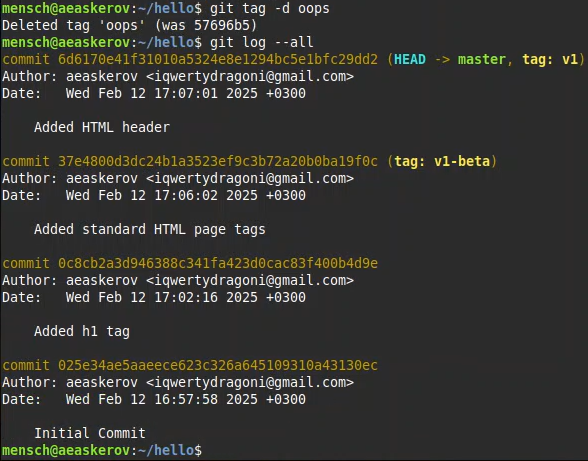{#fig:049 width=35%}

Тег «oops» больше не будет отображаться в репозитории.

## Внесение изменений в коммиты

### Изменим страницу, а затем сделаем коммит

Добавим в страницу комментарий автора.

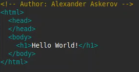{#fig:050 width=25%}

Выполним следующее.

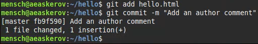{#fig:051 width=40%}

## Внесение изменений в коммиты

### Необходим email

После совершения коммита к комментарию стоит добавить электронную почту автора. 

Обновим страницу hello, включив в неё email.

{#fig:052 width=70%}

## Внесение изменений в коммиты

### Изменим предыдущий коммит

Мы не хотим создавать отдельный коммит только ради электронной почты. Поэтому изменим предыдущий коммит, включив в него адрес электронной почты.

{#fig:053 width=70%}

## Внесение изменений в коммиты

### Просмотр истории

Выполним следующее.

{#fig:054 width=30%}

## Внесение изменений в коммиты

Мы можем увидеть, что оригинальный коммит «автор» заменён коммитом «автор/email». Этого же эффекта можно достичь путём сброса последнего коммита в ветке, и повторного коммита новых изменений.

## Перемещение файлов

### Переместим файл hello.html в каталог lib

Сейчас мы собираемся создать структуру нашего репозитория. Перенесём страницу в каталог lib.

{#fig:055 width=50%}

## Второй способ перемещения файлов

Мы могли бы выполнить:

``` bash
mkdir lib
mv hello.html lib
git add lib/hello.html
git rm hello.html
```

## Второй способ перемещения файлов

### Коммит в новый каталог

Сделаем коммит этого перемещения.

{#fig:056 width=40%}

## Подробнее о структуре

### Добавление index.html

Добавим файл index.html в наш репозиторий.

{#fig:057 width=40%}

Укажем в нём следующее содержимое.

{#fig:058 width=30%}

## Подробнее о структуре

Добавим файл и сделаем коммит.

{#fig:059 width=45%}

Теперь при открытии index.html, мы увидим кусок страницы hello в маленьком окошке.

{#fig:060 width=25%}

## Git внутри: Каталог .git

### Каталог .git

Выполним следующее.

{#fig:061 width=60%}

Это каталог, в котором хранится вся информация git.

## Git внутри: Каталог .git

### База данных объектов

Выполним следующее.

{#fig:062 width=60%}

Мы видим набор каталогов, имена которых состоят из 2 символов. Имена каталогов являются первыми двумя буквами хэша sha1 объекта, хранящегося в git.

### Углубляемся в базу данных объектов

Выполним следующее.

{#fig:063 width=40%}

## Git внутри: Каталог .git

Здесь мы смотрим в один из каталогов с именем из 2 букв. В результате мы видим файлы с именами из 38 символов. Это файлы, содержащие объекты, хранящиеся в git. Они сжаты и закодированы, поэтому просмотр их содержимого может мало чем помочь.

### Config File

Выполним следующее.

{#fig:064 width=30%}

Это файл конфигурации, создающийся для каждого конкретного проекта. Записи в этом файле будут перезаписывать записи в файле .gitconfig нашего главного каталога, по крайней мере в рамках этого проекта.

## Git внутри: Каталог .git

### Ветки и теги

Выполним следующее.

{#fig:065 width=30%}

Здесь каждый файл соответствует тегу, ранее созданному с помощью команды git tag. Его содержание – это всего лишь хэш коммита, привязанный к тегу.

Каталог heads практически аналогичен, но используется для веток, а не тегов. На данный момент у нас есть только одна ветка, так что всё, что мы увидим в этом каталоге – это ветка master.

## Git внутри: Каталог .git

### Файл HEAD

Выполним следующее.

{#fig:066 width=30%}

Файл HEAD содержит ссылку на текущую ветку, в данный момент это должна быть ветка master.

## Работа непосредственно с объектами git

### Поиск последнего коммита

Выполним следующее.

{#fig:067 width=70%}

Эта команда показывает последний коммит в репозиторий. SHA1 хэш у разных пользователей, вероятно, отличается от этого, но отображаемый результат похож на этот.

## Работа непосредственно с объектами git

### Вывод последнего коммита с помощью SHA1 хэша

Выполним следующее.

{#fig:068 width=40%}

## Работа непосредственно с объектами git

### Поиск дерева

Мы можем вывести дерево каталогов, ссылка на который идёт в коммите. Это должно быть описание файлов (верхнего уровня) в нашем проекте (для конкретного коммита). Используем SHA1 хэш из строки «дерева», из списка выше.

Выполним следующее.

{#fig:069 width=40%}

## Работа непосредственно с объектами git

### Вывод каталога lib

Выполним следующее.

{#fig:070 width=35%}

## Работа непосредственно с объектами git

### Вывод файла hello.html

Выполним следующее.

{#fig:071 width=35%}

## Создание ветки

Пора сделать наш hello world более выразительным. Так как это может занять некоторое время, лучше переместить эти изменения в отдельную ветку, чтобы изолировать их от изменений в ветке master.

### Создадим ветку

Назовём нашу новую ветку «style».

Выполним следующее.

{#fig:072 width=35%}

Команда git status сообщает о том, что мы находимся в ветке «style».

## Создание ветки

### Добавим файл стилей style.css

Выполним следующее.

{#fig:073 width=35%}

Укажем в нём следующее содержимое.

{#fig:074 width=20%}

## Создание ветки

Выполним следующее.

{#fig:075 width=35%}

### Изменим основную страницу

Обновим файл hello.html, чтобы использовать стили style.css.

{#fig:076 width=35%}

## Создание ветки

Выполним следующее.

{#fig:077 width=35%}

### Изменим index.html

Обновим файл index.html, чтобы он тоже использовал style.css.

{#fig:078 width=35%}

## Создание ветки

Выполним следующее.

{#fig:079 width=35%}

## Навигация по веткам

Теперь в нашем проекте есть две ветки.

Выполним следующее.

## Навигация по веткам

{#fig:080 width=35%}

## Навигация по веткам

### Переключение на ветку master

Используем команду git checkout для переключения между ветками.

{#fig:081 width=35%}

Сейчас мы находимся на ветке master. Это заметно по тому, что файл hello.html не использует стили style.css.

## Навигация по веткам

### Вернёмся к ветке style

Выполним следующее.

{#fig:082 width=40%}

Содержимое lib/hello.html подтверждает, что мы вернулись на ветку style.

## Изменения в ветке master

Пока мы меняли ветку style, кто-то решил обновить ветку master. Они добавили файл README.md.

### Создадим файл README в ветке master

Выполним следующее.

{#fig:083 width=25%}

Создадим файл README.md.

{#fig:084 width=70%}

## Сделаем коммит изменений README.md в ветку master

Выполним следующее.

{#fig:085 width=25%}

## Сделаем коммит изменений README.md в ветку master

### Просмотр отличающихся веток

### Просмотрим текущие ветки

Теперь у нас в репозитории есть две отличающиеся ветки. Используем следующую лог-команду для просмотра веток и их отличий.

{#fig:086 width=50%}

## Слияние

### Слияние веток

Слияние переносит изменения из двух веток в одну. Вернёмся к ветке style и сольём master со style.

{#fig:087 width=40%}

## Слияние

{#fig:088 width=50%}

## Создание конфликта

### Вернёмся в master и создадим конфликт

Вернёмся в ветку master.

{#fig:089 width=35%}

Внесём следующие изменения.

{#fig:090 width=30%}

## Создание конфликта

Выполним следующее.

{#fig:091 width=35%}

## Создание конфликта

### Просмотр веток

Выполним следующее.

## Создание конфликта

{#fig:092 width=40%}

## Создание конфликта

После коммита «Added README» ветка master была объединена с веткой style, но в настоящее время в master есть дополнительный коммит, который не был слит со style.

Последнее изменение в master конфликтует с некоторыми изменениями в style. На следующем шаге мы решим этот конфликт.

## Разрешение конфликтов

### Слияние master с веткой style

Теперь вернёмся к ветке style и попытаемся объединить её с новой веткой master.

Выполним следующее.

{#fig:093 width=35%}

## Разрешение конфликтов

Если мы откроем lib/hello.html, то увидим следующее.

{#fig:094 width=35%}

Первый раздел – версия текущей ветки (style). Второй раздел – версия ветки master.

## Разрешение конфликтов

### Решение конфликта

Нам необходимо вручную разрешить конфликт. Внесём изменения в lib/hello.html для достижения следующего результата.

{#fig:095 width=35%}

## Разрешение конфликтов

### Сделаем коммит решения конфликта

Выполним следующее.

{#fig:096 width=45%}

## Разрешение конфликтов

### Перебазирование как альтернатива слиянию

Рассмотрим различия между слиянием и перебазированием. Для того, чтобы это сделать, нам нужно вернуться в репозиторий в момент до первого слияния, а затем повторить те же действия, но с использованием перебазирования вместо слияния.

Мы будем использовать команду reset для возврата веток к предыдущему состоянию.

## Сброс ветки style

### Сброс ветки style

Вернёмся на ветке style к точке перед тем, как мы слили её с веткой master. Мы можем сбросить ветку к любому коммиту. По сути, это изменение указателя ветки на любую точку дерева коммитов.

В этом случае мы хотим вернуться в ветке style в точку перед слиянием с master. Нам необходимо найти последний коммит перед слиянием.

Выполним следующее.

{#fig:097 width=35%}

## Сброс ветки style

{#fig:098 width=70%}

## Сброс ветки style

Мы видим, что коммит «Updated index.html» был последним на ветке style перед слиянием. Сбросим ветку style к этому коммиту.

{#fig:099 width=35%}

## Сброс ветки style

### Проверим ветку

Поищем лог ветки style. У нас в истории больше нет коммитов слияний.

{#fig:100 width=35%}

## Сброс ветки master

### Сброс ветки master

Добавив интерактивный режим в ветку master, мы внесли изменения, конфликтующие с изменениями в ветке style. Вернёмся в ветке master в точку перед внесением конфликтующих изменений. Это позволяет нам продемонстрировать работу команды git rebase, не беспокоясь о конфликтах.

{#fig:101 width=35%}

## Сброс ветки master

{#fig:102 width=70%}

## Сброс ветки master

Коммит «Added README» идёт непосредственно перед коммитом конфликтующего интерактивного режима. Мы сбросим ветку master к коммиту «Added README».

{#fig:103 width=35%}

## Сброс ветки master

{#fig:104 width=35%}

## Сброс ветки master

Лог выглядит, как будто репозиторий был перемотан назад во времени к точке до какого-либо слияния.

## Перебазирование

Используем команду rebase вместо команды merge. Мы вернулись в точку до первого слияния и хотим перенести изменения из ветки master в нашу ветку style. На этот раз для переноса изменений из ветки master мы используем команду git rebase вместо слияния.

{#fig:105 width=40%}

## Перебазирование

{#fig:106 width=50%}

## Перебазирование

### Слияние VS перебазирование

Конечный результат перебазирования очень похож на результат слияния. Ветка style в настоящее время содержит все свои изменения, а также все изменения ветки master. Однако, дерево коммитов значительно отличается. Дерево коммитов ветки style было переписано таким образом, что ветка master является частью истории коммитов. Это делает цепь коммитов линейной и гораздо более читабельной.

## Слияние в ветку master

Мы поддерживали соответствие ветки style с веткой master (с помощью rebase), теперь же сольём изменения style в ветку master.

### Слияние style в master

Выполним следующее.

{#fig:107 width=35%}

## Слияние в ветку master

Поскольку последний коммит ветки master прямо предшествует последнему коммиту ветки style, git может выполнить ускоренное слияние-перемотку. При быстрой перемотке вперёд git просто передвигает указатель вперёд, таким образом указывая на тот же коммит, что и ветка style.

При быстрой перемотке конфликтов быть не может.

## Слияние в ветку master

### Просмотрим логи

Выполним следующее.

{#fig:108 width=50%}

## Слияние в ветку master

Теперь ветки style и master идентичны.

## Клонирование репозиториев

### Перейдём в рабочий каталог

Перейдём в рабочий каталог и сделаем клон нашего репозитория hello.

{#fig:109 width=50%}

Сейчас мы находимся в рабочем каталоге. Здесь есть единственный репозиторий под названием «hello».

## Клонирование репозиториев

### Создадим клон репозитория hello

Создадим клон репозитория.

{#fig:110 width=50%}

В нашем рабочем каталоге теперь есть два репозитория: оригинальный репозиторий «hello» и клонированный репозиторий «cloned_hello».

## Просмотр клонированного репозитория

### Взглянем на клонированный репозиторий

{#fig:111 width=35%}

Мы видим список всех файлов на верхнем уровне оригинального репозитория README.md, index.html и lib.

## Просмотр клонированного репозитория

### Просмотрим историю репозитория

Выполним следующее.

## Просмотр клонированного репозитория

{#fig:112 width=50%}

## Просмотр клонированного репозитория

Мы видим список всех коммитов в новый репозиторий, и он (более или менее) совпадает с историей коммитов в оригинальном репозитории. Единственная разница должна быть в названиях веток.

### Удалённые ветки

Мы видим ветку master (HEAD) в списке истории. Мы также видим ветки со странными именами (origin/master, origin/style и origin/HEAD).

## Что такое origin?

Выполним следующее.

{#fig:113 width=35%}

Мы видим, что клонированный репозиторий знает об имени по умолчанию удалённого репозитория. Посмотрим, можем ли мы получить более подробную информацию об имени по умолчанию.

## Что такое origin?

Выполним следующее.

{#fig:114 width=35%}

## Удалённые ветки

Давайте посмотрим на ветки, доступные в нашем клонированном репозитории.

{#fig:115 width=35%}

Как мы видим, в списке только ветка master. Где ветка style? Команда git branch выводит только список локальных веток по умолчанию.

## Удалённые ветки

### Список удалённых веток

Для того, чтобы увидеть все ветки, попробуем следующую команду.

{#fig:116 width=35%}

Git выводит все коммиты в оригинальный репозиторий, но ветки в удалённом репозитории не рассматриваются как локальные. Если мы хотим собственную ветку style, мы должны сами её создать. Скоро мы увидим, как это делается.

## Изменение оригинального репозитория

Внесём некоторые изменения в оригинальный репозиторий, чтобы затем попытаться извлечь и слить изменения из удалённой ветки в текущую.

### Внесём изменения в оригинальный репозиторий hello

Выполним следующее.

{#fig:117 width=35%}

Примечание: Сейчас мы находимся в репозитории hello

## Изменение оригинального репозитория

Внесём следующие изменения в файл README.md.

{#fig:118 width=35%}

Выполним следующее.

{#fig:119 width=35%}

Теперь в оригинальном репозитории есть более поздние изменения, которых нет в клонированной версии. Далее мы извлечём и сольём эти изменения в клонированный репозиторий.

## Изменение оригинального репозитория

### Извлечение изменений

Научимся извлекать изменения из удалённого репозитория.

{#fig:120 width=35%}

## Изменение оригинального репозитория

{#fig:121 width=40%}

## Изменение оригинального репозитория

Сейчас мы находимся в репозитории cloned_hello.

На данный момент в репозитории есть все коммиты из оригинального репозитория, но они не интегрированы в локальные ветки клонированного репозитория.

В истории выше найдём коммит «Changed README in original repo». Обратим внимание, что коммит включает в себя коммиты «origin/master» и «origin/HEAD».

Теперь посмотрим на коммит «Updated index.html». Мы увидим, что локальная ветка master указывает на этот коммит, а не на новый коммит, который мы только что извлекли.

Выводом является то, что команда git fetch будет извлекать новые коммиты из удалённого репозитория, но не будет сливать их с нашими наработками в локальных ветках.

## Изменение оригинального репозитория

### Проверим README.md

Мы можем продемонстрировать, что клонированный файл README.md не изменился.

{#fig:122 width=35%}

## Слияние извлечённых изменений

### Сольём извлечённые изменения в локальную ветку master

Выполним следующее.

{#fig:123 width=35%}

## Слияние извлечённых изменений

### Ещё раз проверим файл README.md

Сейчас мы увидим изменения.

{#fig:124 width=35%}

Хотя команда git fetch не сливает изменения, мы можем вручную слить изменения из удалённого репозитория.

Теперь давайте рассмотрим объединение fetch и merge в одну команду.

{#fig:125 width=35%}

## Добавление ветки наблюдения

Ветки, которые начинаются с remotes/origin являются ветками оригинального репозитория. Обратим внимание, что у нас больше нет ветки под названием style, но система контроля версий знает, что в оригинальном репозитории ветка style была.

### Добавим локальную ветку, которая отслеживает удалённую ветку

Выполним следующее.

{#fig:126 width=30%}

Теперь мы можем видеть ветку style в списке веток и логе.

## Чистые репозитории

Чистые репозитории (без рабочих каталогов) обычно используются для расшаривания. Обычный git-репозиторий подразумевает, что мы будем использовать его как рабочую директорию, поэтому вместе с файлами проекта в актуальной версии, git хранит все служебные, «чисто-репозиториевские» файлы в поддиректории .git. В удалённых репозиториях нет смысла хранить рабочие файлы на диске (как это делается в рабочих копиях), а все что им действительно нужно – это дельты изменений и другие бинарные данные репозитория. Вот это и есть «чистый репозиторий».

## Создадим чистый репозиторий

{#fig:127 width=35%}

Сейчас мы находимся в рабочем каталоге.

Как правило, репозитории, оканчивающиеся на .git являются чистыми репозиториями. Мы видим, что в репозитории hello.git нет рабочего каталога. По сути, это есть не что иное, как каталог .git нечистого репозитория.

## Добавление удалённого репозитория

Давайте добавим репозиторий hello.git к нашему оригинальному репозиторию.

{#fig:128 width=35%}

## Отправка изменений

Так как чистые репозитории, как правило, расшариваются на каком-нибудь сетевом сервере, нам необходимо отправить наши изменения в другие репозитории. Начнём с создания изменения для отправки.

Отредактируем файл README.md и сделаем коммит.

{#fig:129 width=35%}

{#fig:130 width=35%}

## Отправка изменений

Теперь отправим изменения в общий репозиторий.

{#fig:131 width=35%}

Общим называется репозиторий, получающий отправленные нами изменения.

## Извлечение общих изменений

Научимся извлекать изменения из общего репозитория. Быстро переключимся в клонированный репозиторий и извлечём изменения, только что отправленные в общий репозиторий.

{#fig:132 width=35%}

{#fig:133 width=35%}

# Выводы

Получены навыки работы с системой git.

