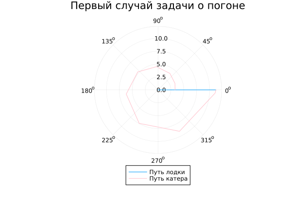
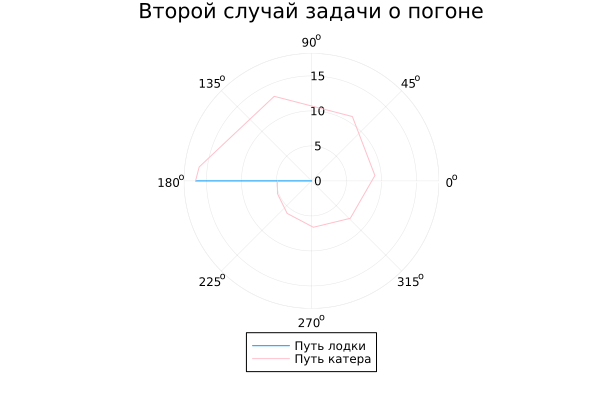
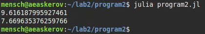

---
## Front matter
title: "Лабораторная работа №2"
subtitle: "Задача о погоне"
author: "Аскеров Александр Эдуардович"

## Generic otions
lang: ru-RU
toc-title: "Содержание"

## Bibliography
bibliography: bib/cite.bib
csl: pandoc/csl/gost-r-7-0-5-2008-numeric.csl

## Pdf output format
toc: true # Table of contents
toc-depth: 2
lof: true # List of figures
lot: false # List of tables
fontsize: 12pt
linestretch: 1.5
papersize: a4
documentclass: scrreprt
## I18n polyglossia
polyglossia-lang:
  name: russian
  options:
	- spelling=modern
	- babelshorthands=true
polyglossia-otherlangs:
  name: english
## I18n babel
babel-lang: russian
babel-otherlangs: english
## Fonts
mainfont: IBM Plex Serif
romanfont: IBM Plex Serif
sansfont: IBM Plex Sans
monofont: IBM Plex Mono
mathfont: STIX Two Math
mainfontoptions: Ligatures=Common,Ligatures=TeX,Scale=0.94
romanfontoptions: Ligatures=Common,Ligatures=TeX,Scale=0.94
sansfontoptions: Ligatures=Common,Ligatures=TeX,Scale=MatchLowercase,Scale=0.94
monofontoptions: Scale=MatchLowercase,Scale=0.94,FakeStretch=0.9
mathfontoptions:
## Biblatex
biblatex: true
biblio-style: "gost-numeric"
biblatexoptions:
  - parentracker=true
  - backend=biber
  - hyperref=auto
  - language=auto
  - autolang=other*
  - citestyle=gost-numeric
## Pandoc-crossref LaTeX customization
figureTitle: "Рис."
tableTitle: "Таблица"
listingTitle: "Листинг"
lofTitle: "Список иллюстраций"
lotTitle: "Список таблиц"
lolTitle: "Листинги"
## Misc options
indent: true
header-includes:
  - \usepackage{indentfirst}
  - \usepackage{float} # keep figures where there are in the text
  - \floatplacement{figure}{H} # keep figures where there are in the text
---

# Цель работы

Построить математическую модель для выбора правильной стратегии при решении примера задачи о погоне.

# Задание

**Вариант 59**

На море в тумане катер береговой охраны преследует лодку браконьеров. Через определённый промежуток времени туман рассеивается, и лодка обнаруживается на расстоянии 20,3 км от катера. Затем лодка снова скрывается в тумане и уходит прямолинейно в неизвестном направлении. Известно, что скорость катера в 5,2 раза больше скорости браконьерской лодки.
1. Запишите уравнение, описывающее движение катера, с начальными условиями для двух случаев (в зависимости от расположения катера относительно лодки в начальный момент времени).
2. Постройте траекторию движения катера и лодки для двух случаев.
3. Найдите точку пересечения траектории катера и лодки.

Расстояние от лодки до катера:
$$ k = 20.3\text{ km} $$

Во сколько раз скорость катера больше скорости лодки:
$$ \times 5.2 $$

# Теоретическое введение

Кривая погони -- кривая, представляющая собой решение задачи о погоне, которая ставится следующим образом. Пусть точка A равномерно движется по некоторой заданной кривой. Требуется найти траекторию равномерного движения точки P такую, что касательная, проведённая к траектории в любой момент движения, проходила бы через соответствующее этому моменту положение точки A.

# Выполнение лабораторной работы

## Вывод уравнения

Запишем уравнение описывающее движение катера, с начальными условиями для двух случаев (в зависимости от расположения катера относительно лодки в начальный момент времени).

1. Примем за $t_0 = 0$, $x_0 = 0$ -- место нахождения лодки браконьеров в момент обнаружения, $x_{k0} = k$ -- место нахождения катера береговой охраны относительно лодки браконьеров в момент обнаружения лодки.

2. Введём полярные координаты. Считаем, что полюс -- это точка обнаружения лодки браконьеров $x_{k0}$ ($\theta = x_{k0} = 0)$, а полярная ось $r$ проходит через точку нахождения катера береговой охраны.

3. Траектория катера должна быть такой, чтобы и катер, и лодка всё время были на одном расстоянии от полюса $\theta$ , только в этом случае траектория катера пересечётся с траекторией лодки. Поэтому для начала катер береговой охраны должен двигаться некоторое время прямолинейно, пока не окажется на том же расстоянии от полюса, что и лодка браконьеров. После этого катер береговой охраны должен двигаться вокруг полюса, удаляясь от него с той же скоростью, что и лодка браконьеров.

4. Чтобы найти расстояние $x$ (расстояние после которого катер начнёт двигаться вокруг полюса), необходимо составить простое уравнение. Пусть через время $t$ катер и лодка окажутся на одном расстоянии $x$ от полюса. За это время лодка пройдёт $x$ , а катер $k-x$ (или $k+x$, в зависимости от начального положения катера относительно полюса). Время, за которое они пройдут это расстояние, вычисляется как $\dfrac{x}{v}$ или $\dfrac{k-x}{5.2v}$ (во втором случае $\dfrac{k+x}{5.2v}$). Так как время одно и то же, то эти величины одинаковы. Тогда неизвестное расстояние $x$ можно найти из следующего уравнения:

$$
\dfrac{x}{v} = \dfrac{k-x}{5.2v} \text{ -- в первом случае}
$$

$$
\dfrac{x}{v} = \dfrac{k+x}{5.2v} \text{ -- во втором случае}
$$

Отсюда мы найдем два значения $x_1 = \dfrac{20.3}{6.2}$ и $x_2 = \dfrac{20.3}{4.2}$, задачу будем решать для двух случаев.

5. После того, как катер береговой охраны окажется на таком же расстоянии от полюса, что и лодка, он должен сменить прямолинейную траекторию и начать двигаться вокруг полюса, удаляясь от него со скоростью лодки $v$. Для этого скорость катера раскладываем на две составляющие: $v_{r}$ -- радиальная скорость и  -- $v_{\tau}$ тангенциальная скорость. Радиальная скорость -- это скорость, с которой катер удаляется от полюса, $v_r = \dfrac{dr}{dt}$. Нам нужно, чтобы эта скорость была равна скорости лодки, поэтому полагаем $\dfrac{dr}{dt} = v$.

Тангенциальная скорость -- это линейная скорость вращения катера относительно полюса. Она равна произведению угловой скорости $\dfrac{d \theta}{dt}$ на радиус $r$, $r \dfrac{d \theta}{dt}$.

Получаем: 

$$v_{\tau} = \sqrt{27.04v^2-v^2} = \sqrt{26.04}v$$

Из чего можно вывести:

$$
r\dfrac{d \theta}{dt} = \sqrt{26.04}v
$$

6. Решение исходной задачи сводится к решению системы из двух дифференциальных уравнений:

$$\begin{cases}
&\dfrac{dr}{dt} = v\\
&r\dfrac{d \theta}{dt} = \sqrt{26.04}v
\end{cases}$$

С начальными условиями для первого случая:

$$\begin{cases}
&{\theta}_0 = 0\\  \tag{1}
&r_0 = \dfrac{20.3}{6.2}
\end{cases}$$

Или для второго:

$$\begin{cases}
&{\theta}_0 = -\pi\\  \tag{2}
&r_0 = \dfrac{20.3}{4.2}
\end{cases}$$

Исключая из полученной системы производную по $t$, можно перейти к следующему уравнению:

$$
\dfrac{dr}{d \theta} = \dfrac{r}{\sqrt{26.04}}
$$

Начальные условия остаются прежними. Решив это уравнение, мы получим траекторию движения катера в полярных координатах.

## Вывод траектории движения

Построим траекторию движения катера и лодки для двух случаев с произвольными начальными значениями.

*Программа 1*

``` julia
using DifferentialEquations
using Plots

k = 20.3
n = 5.2
function dr(u, p, t)
    return u/sqrt(n*n - 1)
end 

# Первый случай
r0 = k/(n + 1)
theta = (0, 2*pi)

prob = ODEProblem(dr, r0, theta)
sol = solve(prob, abstol = 1e-8, reltol = 1e-8)
r_ang = [sol.t[rand(1:size(sol.t)[1])] for i in 1:size(sol.t)[1]]

plt = plot(proj=:polar, aspect_ratio=:equal, title="Первый случай задачи о погоне", legend=:outerbottom)
plot!(plt, [r_ang[1], r_ang[2]], [0.0, sol.u[size(sol.u)[1]]], label="Путь лодки")
plot!(plt, sol.t, sol.u, label="Путь катера", color=:pink)
savefig("2_1.png")

# Второй случай
r0 = k/(n - 1)
theta = (-pi, pi)

prob = ODEProblem(dr, r0, theta)
sol = solve(prob, abstol=1e-8, reltol=1e-8)
r_ang = [sol.t[rand(1:size(sol.t)[1])] for i in 1:size(sol.t)[1]]

plt = plot(proj=:polar, aspect_ratio=:equal, title="Второй случай задачи о погоне", legend=:outerbottom)
plot!(plt, [r_ang[1], r_ang[2]], [0.0, sol.u[size(sol.u)[1]]], label="Путь лодки")
plot!(plt, sol.t, sol.u, label="Путь катера", color=:pink)
savefig("2_2.png")
```

Получаем следующий результат выполнения программы.

{#fig:001 width=70%}

{#fig:002 width=70%}

## Вывод точки пересечения

Найдём точку пересечения траектории катера и лодки. Для этого найдём аналитическое решение дифференциального уравнения, задающего траекторию движения катера.

*Программа 2*

``` julia
s1(t) = 20.3/6.2*exp(t/sqrt(26.04))
sol1 = s1(7*pi/4)
println(sol1)

s2(t) = 20.3/4.2*exp((t+pi)/sqrt(26.04))
sol2 = s2(-pi/4)
println(sol2)
```

Получаем следующий результат выполнения программы.

{#fig:003 width=70%}

# Выводы

Построена математическая модель для выбора правильной стратегии при решении примера задачи о погоне.

# Список литературы{.unnumbered}

[1] Julia [https://julialang.org/learning/getting-started/]
