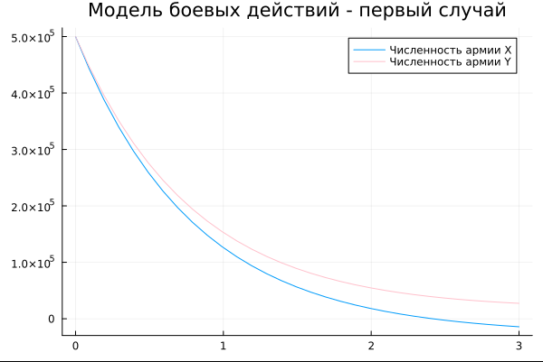
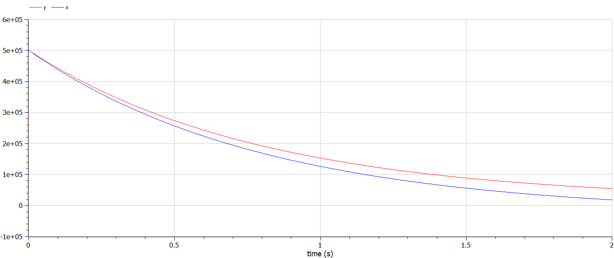
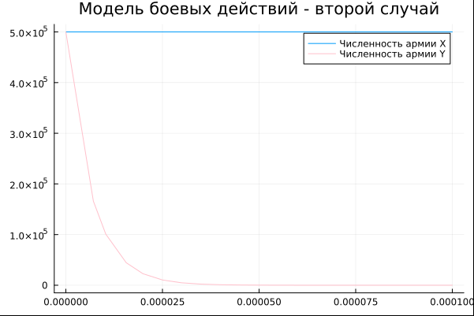
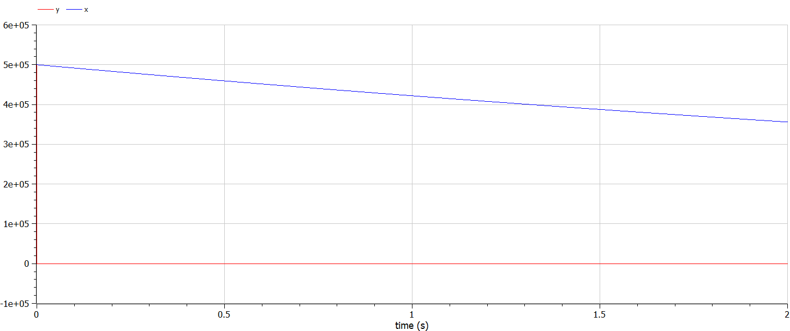

---
## Front matter
lang: ru-RU
title: Лабораторная работа №3
subtitle: Модель боевых действий
author:
  - Аскеров А.Э.
institute:
  - Российский университет дружбы народов, Москва, Россия
date: 22 марта 2025

## i18n babel
babel-lang: russian
babel-otherlangs: english

## Formatting pdf
toc: false
toc-title: Содержание
slide_level: 2
aspectratio: 169
section-titles: true
theme: metropolis
header-includes:
 - \metroset{progressbar=frametitle,sectionpage=progressbar,numbering=fraction}
---

# Информация

## Докладчик

:::::::::::::: {.columns align=center}
::: {.column width="70%"}

  * Аскеров Александр Эдуардович
  * Российский университет дружбы народов

:::
::: {.column width="30%"}

:::
::::::::::::::

# Цель работы

Построить модель боевых действий на языке программирования Julia, а также с помощью OpenModelica.

# Задание

Между страной $X$ и страной $Y$ идёт война. Численность состава войск исчисляется от начала войны, и является временными функциями $x(t)$ и $y(t)$. В начальный момент времени страна $X$ имеет армию численностью 500 000 человек, а в распоряжении страны $Y$ армия численностью в 500 000 человек. Для упрощения модели считаем, что коэффициенты $a, b, c, h$ постоянны. Также считаем, что $P(t)$ и $Q(t)$ -- непрерывные функции.

## Задание

Построить графики изменения численности войск армии $X$ и армии $Y$ для  следующих случаев:

1. Модель боевых действий между регулярными войсками
$$\begin{cases}
    \dfrac{dx}{dt} = -0.45x(t)- 0.86y(t)+sin(t+1)\\\\
    \dfrac{dy}{dt} = -0.49x(t)- 0.73y(t)+cos(t+2)
\end{cases}$$

## Задание

2. Модель ведения боевых действий с участием регулярных войск и партизанских отрядов

$$\begin{cases}
    \dfrac{dx}{dt} = -0.17x(t)-0.65y(t)+sin(2t)+2\\\\
    \dfrac{dy}{dt} = -0.31x(t)y(t)-0.28y(t)+cos(t)+2
\end{cases}$$

# Теоретическое введение

Уравнения Ланчестера (законы Осипова-Ланчестера) -- это дифференциальные уравнения, описывающие зависимость между силами сражающихся сторон A и D как функцию от времени, причём функция зависит только от A и D.

В 1916 году, в разгар первой мировой войны, Фредерик Ланчестер разработал систему дифференциальных уравнений для демонстрации соотношения между противостоящими силами. Среди них есть так называемые Линейные законы Ланчестера (первого рода или честного боя, для рукопашного боя или неприцельного огня) и Квадратичные законы Ланчестера (для войн начиная с XX века с применением прицельного огня, дальнобойных орудий, огнестрельного оружия).

# Выполнение лабораторной работы

## Модель боевых действий между регулярными войсками

$$\begin{cases}
    \dfrac{dx}{dt} = -0.45x(t)-0.86y(t)+sin(t+1)\\\\
    \dfrac{dy}{dt} = -0.49x(t)-0.73y(t)+cos(t+2)
\end{cases}$$

Потери, не связанные с боевыми действиями, описывают члены $-0.45x(t)$ и $-0.73y(t)$ (коэффициенты при $x$ и $y$ -- это величины, характеризующие степень влияния различных факторов на потери), члены $-0.86y(t)$ и $-0.49x(t)$ отражают потери на поле боя (коэффициенты при  $x$ и $y$ указывают на эффективность боевых действий со сторон у и х соответственно). Функции $P(t)=sin(t+1)$, $Q(t)=cos(t+2)$ учитывают возможность подхода подкрепления к войскам $X$ и $Y$ в течение одного дня.

## Модель боевых действий между регулярными войсками

Построим приведённую модель, используя Julia.

В результате получаем следующий график:

{#fig:001 width=35%}

## Модель боевых действий между регулярными войсками

Из графика видно, что выиграла армия страны $Y$, поскольку численность армии страны $X$ стала 0, а потом и вообще ушла в отрицательную часть графика. Потери страны $Y$ очень значительные.

## Модель боевых действий между регулярными войсками

Теперь построим эту же модель с помощью OpenModelica.
В результате получаем следующий график изменения численности армий:

{#fig:002 width=35%}

Здесь всё так же видно, что выиграла армия $Y$.

Также заметим, что график, построенный на Julia, и график из OpenModelica ничем не отличаются. По крайней мере, невооруженным глазом отличий не видно.

## Модель ведение боевых действий с участием регулярных войск и партизанских отрядов

Во втором случае в борьбу добавляются партизанские отряды. Нерегулярные войска в отличии от постоянной армии менее уязвимы, так как действуют скрытно, в этом случае сопернику приходится действовать неизбирательно -- по площадям, занимаемым партизанами. Поэтому считается, что темп потерь партизан, проводящих свои операции в разных местах на некоторой известной территории, пропорционален не только численности армейских соединений, но и численности самих партизан. В результате модель принимает такой вид:
$$\begin{cases}
    \dfrac{dx}{dt} = -0.17x(t)-0.65y(t)+sin(2t)+2\\\\
    \dfrac{dy}{dt} = -0.31x(t)y(t)-0.28y(t)+cos(t)+2
\end{cases}$$

## Модель ведение боевых действий с участием регулярных войск и партизанских отрядов

В этой системе все величины имею тот же смысл, что и в первой модели.

Построим модель на Julia.

В результате получаем следующий график изменения численности армий.

{#fig:003 width=35%}

## Модель ведение боевых действий с участием регулярных войск и партизанских отрядов

Здесь уже выигрывает армия $X$, причём численность армии $Y$ уменьшается до нуля очень быстро.

## Модель ведение боевых действий с участием регулярных войск и партизанских отрядов

Теперь выполним построение второй модели в OpenModelica.

В результате получается такой график:

{#fig:004 width=35%}

Из графика видно, что выиграла армия $X$, причём моментально. Несмотря на победу над другой армией, армия страны $X$ продолжает нести относительно незначительные потери.

Сравнивая графики, полученные в Julia и OpenModelica, особой разницы не видно. Если приглядеться, можно заметить, что в Julia график выглядит точнее прорисованным.

# Выводы

В процессе выполнения данной лабораторной работы была построена модель боевых действий на языке программирования Julia, а также с помощью OpenModelica. Был проведён сравнительный анализ. В случае с первой моделью, победила армия страны $Y$, в случае со второй моделью, победила армия страны $X$.

