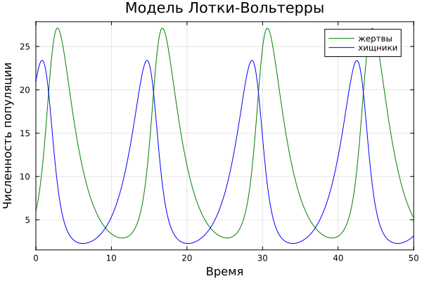
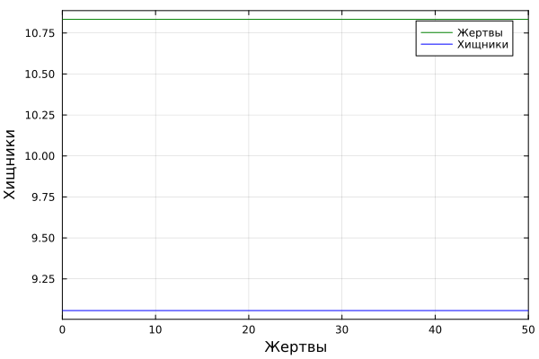
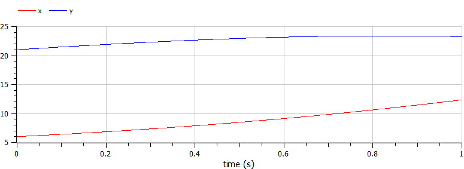
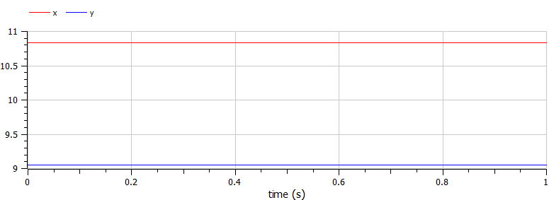

---
## Front matter
title: "Лабораторная работа №5"
subtitle: "Модель хищник-жертва"
author: "Александр Аскеров"

## Generic otions
lang: ru-RU
toc-title: "Содержание"

## Bibliography
bibliography: bib/cite.bib
csl: pandoc/csl/gost-r-7-0-5-2008-numeric.csl

## Pdf output format
toc: true # Table of contents
toc-depth: 2
lof: true # List of figures
lot: false # List of tables
fontsize: 12pt
linestretch: 1.5
papersize: a4
documentclass: scrreprt
## I18n polyglossia
polyglossia-lang:
  name: russian
  options:
	- spelling=modern
	- babelshorthands=true
polyglossia-otherlangs:
  name: english
## I18n babel
babel-lang: russian
babel-otherlangs: english
## Fonts
mainfont: IBM Plex Serif
romanfont: IBM Plex Serif
sansfont: IBM Plex Sans
monofont: IBM Plex Mono
mathfont: STIX Two Math
mainfontoptions: Ligatures=Common,Ligatures=TeX,Scale=0.94
romanfontoptions: Ligatures=Common,Ligatures=TeX,Scale=0.94
sansfontoptions: Ligatures=Common,Ligatures=TeX,Scale=MatchLowercase,Scale=0.94
monofontoptions: Scale=MatchLowercase,Scale=0.94,FakeStretch=0.9
mathfontoptions:
## Biblatex
biblatex: true
biblio-style: "gost-numeric"
biblatexoptions:
  - parentracker=true
  - backend=biber
  - hyperref=auto
  - language=auto
  - autolang=other*
  - citestyle=gost-numeric
## Pandoc-crossref LaTeX customization
figureTitle: "Рис."
tableTitle: "Таблица"
listingTitle: "Листинг"
lofTitle: "Список иллюстраций"
lotTitle: "Список таблиц"
lolTitle: "Листинги"
## Misc options
indent: true
header-includes:
  - \usepackage{indentfirst}
  - \usepackage{float} # keep figures where there are in the text
  - \floatplacement{figure}{H} # keep figures where there are in the text
---

# Цель работы

Исследовать математическую модель Лотки-Вольтерры.

# Задание

**Вариант 59**

Для модели «хищник-жертва»:

$$\begin{cases}
    &\dfrac{dx}{dt} = - 0.48 x(t) + 0.053 x(t)y(t) \\\\
    &\dfrac{dy}{dt} = 0.52 y(t) - 0.048 x(t)y(t)
\end{cases}$$

Построить график зависимости численности хищников от численности жертв, а также графики изменения численности хищников и численности жертв при следующих начальных условиях:
$x_0 = 6, y_0 = 21.$  Найти стационарное состояние системы.

# Теоретическое введение

Модель Ло́тки—Вольте́рры (модель Ло́тки—Вольтерра́) — модель взаимодействия двух видов типа «хищник — жертва», названная в честь своих авторов (Лотка, 1925; Вольтерра 1926), которые предложили модельные уравнения независимо друг от друга.

Такие уравнения можно использовать для моделирования систем «хищник — жертва», «паразит — хозяин», конкуренции и других видов взаимодействия между двумя видами.

В математической форме предложенная система имеет следующий вид:

$$\begin{cases}
    &\dfrac{dx}{dt} = \alpha x(t) - \beta x(t)y(t) \\\\
    &\dfrac{dy}{dt} = -\gamma y(t) + \delta x(t)y(t)
\end{cases}$$

где 
$\displaystyle x$ — количество жертв, 

$\displaystyle y$ — количество хищников, 

${\displaystyle t}$ — время, 

${\displaystyle \alpha, \beta, \gamma, \delta }$ — коэффициенты, отражающие взаимодействия между видами.

# Выполнение лабораторной работы

Решим систему дифференциальных уравнений, используя язык программирования Julia и ПО OpenModelica, для того, чтобы построить графики и сравнить результаты.

## Реализация на Julia  

Для написания программы понадобится библиотека `DifferentialEquations` для решения системы дифференциальных уравнений (ДУ) и библиотека `Plots` для построения графиков.

```Julia
# Используемые библиотеки
using DifferentialEquations, Plots;

# функция для системы ДУ, описывающей модель Лотки-Вольтерры
function LV(u, p, t)
    x, y = u
    a, b, c, d = p
    dx = a*x - b*x*y
    dy = -c*y + d*x*y
    return [dx, dy]
end

# Начальные условия
u0 = [6,21]
p = [-0.48, -0.053, -0.52, -0.048]
tspan = (0.0, 50.0)
prob = ODEProblem(LV, u0, tspan, p)
sol = solve(prob, Tsit5())

# График
plot(sol, title = "Модель Лотки-Вольтерры", xaxis = "Время", yaxis = "Численность популяции", label = ["жертвы" "хищники"], c = ["green" "blue"], box =:on)
savefig("5_1.png")
```

В результате получаем графики изменения численности хищников и численности жертв.

{#fig:001 width=70%}

Графики периодичны.

Далее найдем стационарное состояние системы по формуле:

$$\begin{cases}
  &x_0 = \dfrac{\gamma}{\delta}\\\\
  &y_0 = \dfrac{\alpha}{\beta}
\end{cases}
$$

Получим, что $x_0 = \dfrac{0.48}{0.053} = 9.056603773584905$, а $y_0 = \dfrac{0.52}{0.048}=10,833333333333334$

Проверим, что эта точка действительно является стационарной, подставив ее в начальные условия.

```Julia
x_c = p[3]/p[4]
y_c = p[1]/p[2]
u0_c = [x_c, y_c]
prob2 = ODEProblem(LV, u0_c, tspan, p)
sol2 = solve(prob2, Tsit5())

plot(sol2, xaxis = "Жертвы", yaxis = "Хищники", label = ["Жертвы" "Хищники"], c = ["green" "blue"], box =:on)
savefig("5_2.png")
```

Получим график из двух прямых, параллельных оси абсцисс, то есть численность и жертв, и хищников не меняется, как и должно быть в стационарном состоянии.

{#fig:002 width=70%}

## Реализация на OpenModelica

Зададим параметры и систему ДУ.

```
model lab5_1
  parameter Real a = -0.48;
  parameter Real b = -0.053;
  parameter Real c = -0.52;
  parameter Real d = -0.048;
  parameter Real x0 = 6;
  parameter Real y0 = 21;

  Real x(start=x0);
  Real y(start=y0);
equation
    der(x) = a*x - b*x*y;
    der(y) = -c*y + d*x*y;
end lab5_1;
```

Выполним симуляцию и получим следующий график изменения численности хищников и численности жертв.

{#fig:003 width=70%}

Также построим тут изменения численности хищников и численности жертв в стационарном состоянии.

```
model lab5_2
  parameter Real a = -0.48;
  parameter Real b = -0.053;
  parameter Real c = -0.52;
  parameter Real d = -0.048;
  parameter Real x0 = 0.52/0.048;
  parameter Real y0 = 0.48/0.053;

  Real x(start=x0);
  Real y(start=y0);
equation
    der(x) = a*x - b*x*y;
    der(y) = -c*y + d*x*y;
end lab5_2;
```

Получим график, в котором численность жертв и хищников постоянна.

{#fig:004 width=70%}

# Сравнение построения модели на Julia и в OpenModelica

Полученные графики идентичны.

# Выводы

В результате выполнения лабораторной работы была исследована и построена математическая модель Лотки-Вольтерры на Julia и в OpenModelica.
