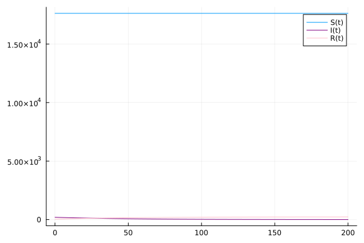
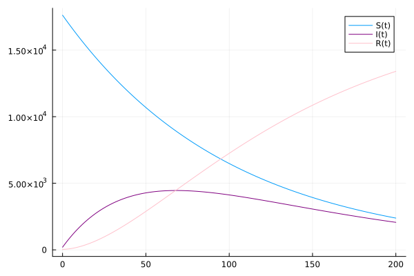

---
## Front matter
title: "Лабораторная работа №6"
subtitle: "Задача об эпидемии"
author: "Александр Аскеров"

## Generic otions
lang: ru-RU
toc-title: "Содержание"

## Bibliography
bibliography: bib/cite.bib
csl: pandoc/csl/gost-r-7-0-5-2008-numeric.csl

## Pdf output format
toc: true # Table of contents
toc-depth: 2
lof: true # List of figures
lot: false # List of tables
fontsize: 12pt
linestretch: 1.5
papersize: a4
documentclass: scrreprt
## I18n polyglossia
polyglossia-lang:
  name: russian
  options:
	- spelling=modern
	- babelshorthands=true
polyglossia-otherlangs:
  name: english
## I18n babel
babel-lang: russian
babel-otherlangs: english
## Fonts
mainfont: IBM Plex Serif
romanfont: IBM Plex Serif
sansfont: IBM Plex Sans
monofont: IBM Plex Mono
mathfont: STIX Two Math
mainfontoptions: Ligatures=Common,Ligatures=TeX,Scale=0.94
romanfontoptions: Ligatures=Common,Ligatures=TeX,Scale=0.94
sansfontoptions: Ligatures=Common,Ligatures=TeX,Scale=MatchLowercase,Scale=0.94
monofontoptions: Scale=MatchLowercase,Scale=0.94,FakeStretch=0.9
mathfontoptions:
## Biblatex
biblatex: true
biblio-style: "gost-numeric"
biblatexoptions:
  - parentracker=true
  - backend=biber
  - hyperref=auto
  - language=auto
  - autolang=other*
  - citestyle=gost-numeric
## Pandoc-crossref LaTeX customization
figureTitle: "Рис."
tableTitle: "Таблица"
listingTitle: "Листинг"
lofTitle: "Список иллюстраций"
lotTitle: "Список таблиц"
lolTitle: "Листинги"
## Misc options
indent: true
header-includes:
  - \usepackage{indentfirst}
  - \usepackage{float} # keep figures where there are in the text
  - \floatplacement{figure}{H} # keep figures where there are in the text
---

# Цель работы

Исследовать модель SIR (задача об эпидемии)

# Задание

**Вариант 59**

На одном острове вспыхнула эпидемия. Известно, что из всех проживающих
на острове ($N=17854$) в момент начала эпидемии ($t=0$) число заболевших людей (являющихся распространителями инфекции) $I(0)=199$, А число здоровых людей с иммунитетом к болезни $R(0)=35$. Таким образом, число людей восприимчивых к болезни, но пока здоровых, в начальный момент времени $S(0)=N-I(0)- R(0)$.

Постройте графики изменения числа особей в каждой из трех групп.

Рассмотрите, как будет протекать эпидемия в случае:

1) если $I(0)\leq I^*$;
2) если $I(0) > I^*$.

# Теоретическое введение

Компартментальные модели являются очень общим методом моделирования. Они часто применяются к математическому моделированию инфекционных заболеваний. Население распределяется по отделениям с помощью меток – например, S, I или R, (Susceptible, Infectious, Recovered). Люди могут переходить из одной категории в другую. Порядок расположения меток обычно показывает структуру потоков между категориями; например, SEIS означает восприимчивый, подверженный воздействию, инфецированный, затем снова восприимчивый.

Зарождение таких моделей относится к началу 20 века, важными работами которого являются работы Росса в 1916 году, Росс и Хадсон в 1917 году, Кермак и Маккендрик в 1927 г. и Кендалл в 1956 году. Модель Рид–Мороз также был важным и широко упускаемым из виду предком современных подходов к эпидемиологическому моделированию.

Модели чаще всего управляются с помощью обыкновенных дифференциальных уравнений (которые являются детерминированными), но также могут использоваться со стохастической (случайной) структурой, которая более реалистична, но гораздо сложнее в анализе.

Модели пытаются предсказать такие вещи, как распространение болезни, или общее число инфицированных, или продолжительность эпидемии, а также оценить различные эпидемиологические параметры, такие как репродуктивное число. Такие модели могут показать, как различные вмешательства общественного здравоохранения могут повлиять на исход эпидемии, например, на то, какой метод является наиболее эффективным для выпуска ограниченного количества вакцин в данной популяции.

# Выполнение лабораторной работы

Приведём программу на языке программирования Julia.

```Julia
using DifferentialEquations, Plots

a = 0.01
b = 0.02
N = 17854
I0 = 199
R0 = 35
S0 = N - I0 - R0
x0 = [S0; I0; R0]
tspan = (0.0, 200.0)

#cлучай, когда I(0)<=I*
function syst(dx, x, p, t)
    dx[1] = 0
    dx[2] = -b*x[2]
    dx[3] = b*x[2]
end

prob = ODEProblem(syst, x0, tspan)
sol = solve(prob, dtmax = 0.05)

S = [x[1] for x in sol.u]
I = [x[2] for x in sol.u]
R = [x[3] for x in sol.u]
T = [t for t in sol.t]

p = plot(T, S, label = "S(t)")
plot!(p, T, I, label = "I(t)", color=:purple)
plot!(p, T, R, label = "R(t)", color=:pink)
savefig("6_1.png")

#cлучай, когда I(0)>I*
function syst(dx, x, p, t)
    dx[1] = -a*x[1]
    dx[2] = a*x[1] - b*x[2]
    dx[3] = b*x[2]
end

prob = ODEProblem(syst, x0, tspan)
sol = solve(prob, dtmax = 0.05)

S = [x[1] for x in sol.u]
I = [x[2] for x in sol.u]
R = [x[3] for x in sol.u]
T = [t for t in sol.t]

p = plot(T, S, label = "S(t)")
plot!(p, T, I, label = "I(t)", color=:purple)
plot!(p, T, R, label = "R(t)", color=:pink)
savefig("6_2.png")
```

Отсюда получаются следующие графики.

{#fig:001 width=70%}

{#fig:002 width=70%}

На OpenModelica аналогичные программы будут выглядеть следующим образом.

Случай, когда $I(0)\leq I^*$.

```
model lab6_1
  parameter Real I_0 = 199;
  parameter Real R_0 = 35;
  parameter Real S_0 = 17620;
  parameter Real N = 17854;
  parameter Real b = 0.01;
  parameter Real c = 0.05;
  
  Real S(start=S_0);
  Real I(start=I_0);
  Real R(start=R_0);
  
equation
  der(S) = 0;
  der(I) = - c*I;
  der(R) = c*I;

end lab6_1;
```

Случай, когда $I(0)>I^*$.

```
model lab6_2
  parameter Real I_0 = 199;
  parameter Real R_0 = 35;
  parameter Real S_0 = 17620;
  parameter Real N = 17854;
  parameter Real b = 0.01;
  parameter Real c = 0.05;
  
  Real S(start=S_0);
  Real I(start=I_0);
  Real R(start=R_0);
  
equation
  der(S) = -(b*S*I)/N;
  der(I) = (b*I*S)/N - c*I;
  der(R) = c*I;

end lab6_2;
```

# Выводы

В результате выполнения данной лабораторной работы была исследована модель SIR.
