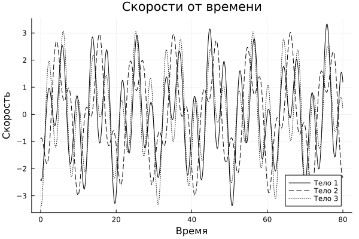
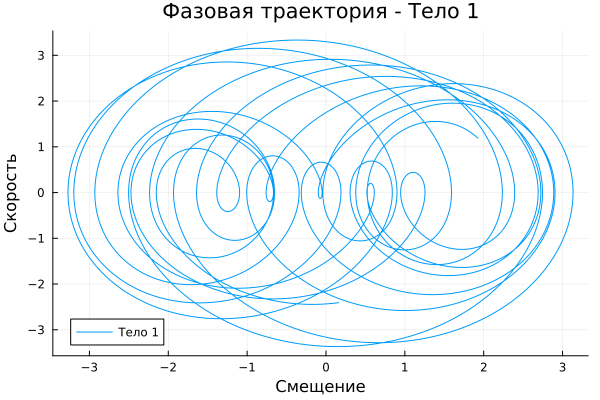

---
## Front matter
lang: ru-RU
title: Этап 3. Описание программной реализации проекта Колебания цепочек
subtitle: Математическое моделирование
author:
- Боровиков Даниил Александрович,
- Аскеров Александр,
- Исаев Булат,
- Гисматуллин Артём,
- Хрусталёв Влад Николаевич,
- Чесноков Артём

institute:
  - Российский университет дружбы народов, Москва, Россия
date: 03 мая 2025

## i18n babel
babel-lang: russian
babel-otherlangs: english

## Formatting pdf
toc: false
toc-title: Содержание
slide_level: 2
aspectratio: 169
section-titles: true
theme: metropolis
header-includes:
 - \metroset{progressbar=frametitle,sectionpage=progressbar,numbering=fraction}
---

# Информация

## Докладчик

:::::::::::::: {.columns align=center}
::: {.column width="70%"}

   	- Боровиков Даниил Александрович,
	- Аскеров Александр,
	- Исаев Булат,
	- Гисматуллин Артем,
	- Хрусталев Влад Николаевич,
	- Чесноков Артем

:::
::: {.column width="38%"}

:::
::::::::::::::

# Введение

## Цель работы

Целью данной лабораторной работы является изучение колебательных цепочек и их программной реализации. В рамках работы необходимо разработать программный комплекс, который позволит моделировать поведение колебательных систем и визуализировать результаты.

# Задание

В данной лабораторной работе необходимо:

1. Разработать программный комплекс для моделирования колебательных цепочек.
2. Реализовать алгоритмы для расчёта смещений и скоростей тел в системе.
3. Визуализировать результаты моделирования в виде графиков.

# Выполнение лабораторной работы

## Описание программы

Для выполнения лабораторной работы была разработана программа на языке Julia, которая моделирует поведение колебательной цепочки. Программа включает следующие этапы:

1. **Определение параметров системы**:
   - Количество тел в системе: $N = 3$
   - Массы тел: $m = [1, 2, 1]$
   - Жёсткости пружин: $k = [1, 1, 1, 1]$
   - Начальные смещения тел: $R_0 = [-0.2, 0, -0.3]$
   - Начальные скорости тел: $v_0 = [1, -3, 0]$

## Описание программы

2. **Расчёт матрицы $\omega$ и матрицы $\Omega$**:
   - Матрица $\omega$ рассчитывается по формуле $\omega_{\alpha \beta} = \frac{k_{\alpha}}{m_{\beta}}$.
   - Матрица $\Omega$ рассчитывается по формуле (8).

3. **Расчёт собственных значений и собственных векторов матрицы $\Omega$**:
   - Собственные значения и векторы используются для расчёта матриц.

## Описание программы

4. **Расчёт координат вектора $C$ и фаз нормальных колебаний**:
   - Вектор $C$ рассчитывается по формулам (18) и (19).
   - Фазы нормальных колебаний рассчитываются по формулам (21) и (22).

5. **Расчёт смещений и скоростей тел на временной сетке**:
   - Временная сетка определяется параметрами $N_1 = 2^{13}$ и $T_{max} = 80$.
   - Смещения и скорости тел рассчитываются на каждом временном шаге.

## Описание программы

6. **Визуализация результатов**:
   - Построены графики смещений и скоростей тел от времени.
   - Построены фазовые траектории для каждого тела.
   - Рассчитаны и визуализированы спектральные плотности смещений.

## Графики

Смещения от времени и скорости от времени.

{#fig:001 width=42%}
{#fig:002 width=42%}

## Графики

Фазовая траектория - Тела 1 и 2.

{#fig:003 width=42%}
{#fig:004 width=42%}

## Графики

Фазовая траектория - Тело 3 и спектральная плотность.

{#fig:005 width=42%}
{#fig:006 width=42%}

# Выводы

В результате выполнения лабораторной работы был разработан программный комплекс для моделирования колебательных цепочек. Программа успешно рассчитывает смещения и скорости тел, а также визуализирует результаты в виде графиков. Полученные данные соответствуют теоретическим ожиданиям, что подтверждает корректность разработанного алгоритма.
