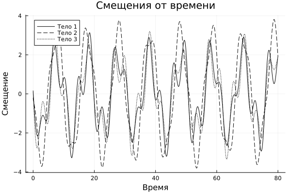
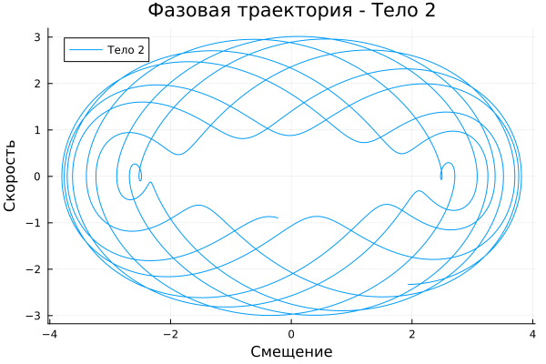
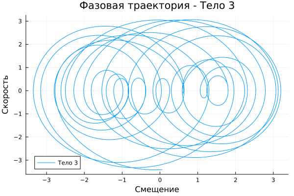
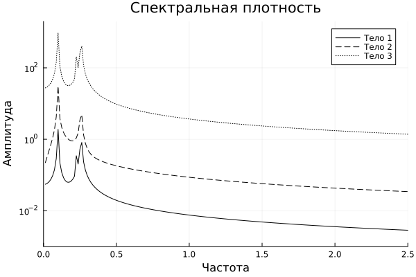

---
## Front matter
title: "Этап 3. Описание программной реализации проекта Колебания цепочек"
subtitle: "Дисциплина: Математическое моделирование"
author:
 - Боровиков Даниил Александрович,
 - Аскеров Александр,
 - Исаев Булат,
 - Гисматуллин Артём,
 - Хрусталёв Влад Николаевич,
 - Чесноков Артём

## Generic otions
lang: ru-RU
toc-title: "Содержание"

## Bibliography
bibliography: bib/cite.bib
csl: pandoc/csl/gost-r-7-0-5-2008-numeric.csl

## Pdf output format
toc: true # Table of contents
toc-depth: 2
lof: true # List of figures
lot: false # List of tables
fontsize: 12pt
linestretch: 1.5
papersize: a4
documentclass: scrreprt
## I18n polyglossia
polyglossia-lang:
  name: russian
  options:
	- spelling=modern
	- babelshorthands=true
polyglossia-otherlangs:
  name: english
## I18n babel
babel-lang: russian
babel-otherlangs: english
## Fonts
mainfont: IBM Plex Serif
romanfont: IBM Plex Serif
sansfont: IBM Plex Sans
monofont: IBM Plex Mono
mathfont: STIX Two Math
mainfontoptions: Ligatures=Common,Ligatures=TeX,Scale=0.94
romanfontoptions: Ligatures=Common,Ligatures=TeX,Scale=0.94
sansfontoptions: Ligatures=Common,Ligatures=TeX,Scale=MatchLowercase,Scale=0.94
monofontoptions: Scale=MatchLowercase,Scale=0.94,FakeStretch=0.9
mathfontoptions:
## Biblatex
biblatex: true
biblio-style: "gost-numeric"
biblatexoptions:
  - parentracker=true
  - backend=biber
  - hyperref=auto
  - language=auto
  - autolang=other*
  - citestyle=gost-numeric
## Pandoc-crossref LaTeX customization
figureTitle: "Рис."
tableTitle: "Таблица"
listingTitle: "Листинг"
lofTitle: "Список иллюстраций"
lotTitle: "Список таблиц"
lolTitle: "Листинги"
## Misc options
indent: true
header-includes:
  - \usepackage{indentfirst}
  - \usepackage{float} # keep figures where there are in the text
  - \floatplacement{figure}{H} # keep figures where there are in the text
---

# Цель работы

Целью данной лабораторной работы является изучение колебательных цепочек и их программной реализации. В рамках работы необходимо разработать программный комплекс, который позволит моделировать поведение колебательных систем и визуализировать результаты [@medved:2010].

# Задание

В данной лабораторной работе необходимо:

1. Разработать программный комплекс для моделирования колебательных цепочек.
2. Реализовать алгоритмы для расчёта смещений и скоростей тел в системе.
3. Визуализировать результаты моделирования в виде графиков.

# Выполнение лабораторной работы

## Описание программы

Для выполнения лабораторной работы была разработана программа на языке Julia, которая моделирует поведение колебательной цепочки. Программа включает следующие этапы:

1. **Определение параметров системы**:
   - Количество тел в системе: $N = 3$
   - Массы тел: $m = [1, 2, 1]$
   - Жёсткости пружин: $k = [1, 1, 1, 1]$
   - Начальные смещения тел: $R_0 = [-0.2, 0, -0.3]$
   - Начальные скорости тел: $v_0 = [1, -3, 0]$

2. **Расчёт матрицы $\omega$ и матрицы $\Omega$**:
   - Матрица $\omega$ рассчитывается по формуле $\omega_{\alpha \beta} = \frac{k_{\alpha}}{m_{\beta}}$.
   - Матрица $\Omega$ рассчитывается по формуле (8).

3. **Расчёт собственных значений и собственных векторов матрицы $\Omega$**:
   - Собственные значения и векторы используются для расчёта матриц.

4. **Расчёт координат вектора $C$ и фаз нормальных колебаний**:
   - Вектор $C$ рассчитывается по формулам (18) и (19).
   - Фазы нормальных колебаний рассчитываются по формулам (21) и (22).

5. **Расчёт смещений и скоростей тел на временной сетке**:
   - Временная сетка определяется параметрами $N_1 = 2^{13}$ и $T_{max} = 80$.
   - Смещения и скорости тел рассчитываются на каждом временном шаге.

6. **Визуализация результатов**:
   - Построены графики смещений и скоростей тел от времени.
   - Построены фазовые траектории для каждого тела.
   - Рассчитаны и визуализированы спектральные плотности смещений.

## Листинг программы

```julia
using LinearAlgebra
using Plots
using FFTW

# число тел колебательной системы
N = 3

# массы тел колебательной системы
m = [1, 2, 1]

# жесткости пружин колебательной системы
k = [1, 1, 1, 1]

# смещения тел в момент времени t = 0
R0 = [-0.2, 0, -0.3]

# скорости тел в момент времени t = 0
v0 = [1, -3, 0]

# вычисление элементов матрицы
omega = zeros(N+1, N)
for alpha in 1:N+1
    for beta in 1:N
        omega[alpha, beta] = k[alpha] / m[beta]
    end
end

# вычисление элементов матрицы OMEGA в соответствии с (8)
OMEGA = zeros(N, N)
for i in 1:N
    if i == 1
        OMEGA[i, i] = omega[1, 1] + omega[2, 1]
        OMEGA[1, 2] = -omega[2, 1]
    elseif i < N
        OMEGA[i, i-1] = -omega[i, i]
        OMEGA[i, i] = omega[i, i] + omega[i+1, i]
        OMEGA[i, i+1] = -omega[i+1, i]
    else  i == N
        OMEGA[i, i-1] = -omega[i, i]
        OMEGA[i, i] = omega[i, i] + omega[i+1, i]
    end
end

# вычисление собственных значений и собственных векторов матрицы OMEGA
eigen_result = eigen(OMEGA)
Sigma = eigen_result.vectors
# вычисление собственных частот
Teta = diagm(sqrt.(eigen_result.values))

SigmaV = zeros(N, N)
for i in 1:N
    for j in 1:N
        SigmaV[j, i] = -Teta[i, i] * Sigma[j, i]
    end
end

# решение системы уравнений (18)
C1 = inv(Sigma) * R0
# решение системы уравнений (19)
C2 = inv(SigmaV) * v0

# вычисление координат вектора C
C = sqrt.(C1.^2 .+ C2.^2)

# вычисление фазы нормальных колебаний в соответствие с (21), (22)
alpha = zeros(N)
for i in 1:N
    if C[i] == 0
        alpha[i] = 0
    else
        alpha[i] = atan(C2[i], C1[i])
        if C1[i] < 0 && C2[i] == 0
            alpha[i] = pi
        elseif C1[i] < 0 && C2[i] < 0
            alpha[i] = alpha[i] - pi
        elseif C1[i] < 0 && C2[i] > 0
            alpha[i] = alpha[i] + pi
        elseif C1[i] > 0 && C2[i] < 0
            alpha[i] = alpha[i] + 2*pi
        end
    end
end

# число узлов временной сетки
N1 = 2^13

# правая граница временного интервала
Tmax = 80

# координаты узлов временной сетки
t = [(j-1)/(N1-1)*Tmax for j in 1:N1]

# вычисление значений координат тел в узлах временной сетки
X = zeros(N, N1)
for j in 1:N1
    s = zeros(N)
    for i in 1:N
        s = s .+ C[i] * Sigma[:, i] .* cos.(Teta[i, i] * t[j] + alpha[i])
    end
    X[:, j] = s
end

# вычисление значений скоростей тел в узлах временной сетки
Xv = zeros(N, N1)
for j in 1:N1
    s = zeros(N)
    for i in 1:N
        s = s .+ C[i] * Sigma[:, i] .* Teta[i, i] .* sin.(Teta[i, i] * t[j] + alpha[i])
    end
    Xv[:, j] = -s
end

# визуализация зависимостей мгновенных значений смещений и скорости от времени
p1 = plot(t, X[1, :], label="Тело 1", linecolor=:black, linestyle=:solid)
plot!(p1, t, X[2, :], label="Тело 2", linecolor=:black, linestyle=:dash)
plot!(p1, t, X[3, :], label="Тело 3", linecolor=:black, linestyle=:dot)
title!(p1, "Смещения от времени")
xlabel!(p1, "Время")
ylabel!(p1, "Смещение")
display(p1)
savefig(p1, "смещения_от_времени.png")

# визуализация изменения скоростей со временем
p2 = plot(t, Xv[1, :], label="Тело 1", linecolor=:black, linestyle=:solid)
plot!(p2, t, Xv[2, :], label="Тело 2", linecolor=:black, linestyle=:dash)
plot!(p2, t, Xv[3, :], label="Тело 3", linecolor=:black, linestyle=:dot)
title!(p2, "Скорости от времени")
xlabel!(p2, "Время")
ylabel!(p2, "Скорость")
display(p2)
savefig(p2, "скорости_от_времени.png")

# построение фазовых траекторий для каждого тела
p3 = plot(X[1, :], Xv[1, :], label="Тело 1", title="Фазовая траектория - Тело 1")
xlabel!(p3, "Смещение")
ylabel!(p3, "Скорость")
display(p3)
savefig(p3, "фазовая_траектория_тело1.png")

p4 = plot(X[2, :], Xv[2, :], label="Тело 2", title="Фазовая траектория - Тело 2")
xlabel!(p4, "Смещение")
ylabel!(p4, "Скорость")
display(p4)
savefig(p4, "фазовая_траектория_тело2.png")

p5 = plot(X[3, :], Xv[3, :], label="Тело 3", title="Фазовая траектория - Тело 3")
xlabel!(p5, "Смещение")
ylabel!(p5, "Скорость")
display(p5)
savefig(p5, "фазовая_траектория_тело3.png")

# вычисление спектров смещения с помощью FFT
c1 = fft(X[1, :])
c2 = fft(X[2, :])
c3 = fft(X[3, :])

# рассчёт спектральной плотности перемещений
Cm1 = abs.(c1[2:N1÷2]) ./ (N1/2)
Cm2 = abs.(c2[2:N1÷2]) ./ (N1/2)
Cm3 = abs.(c3[2:N1÷2]) ./ (N1/2)

# вычисление частот спектральных гармоник
Freq = [(j-1)/Tmax for j in 2:N1÷2]

# визуализация спектральных плотностей перемещений
p6 = plot(Freq, Cm1, label="Тело 1", linecolor=:black, linestyle=:solid, yaxis=:log)
plot!(p6, Freq, 10 .* Cm2, label="Тело 2", linecolor=:black, linestyle=:dash, yaxis=:log)
plot!(p6, Freq, 500 .* Cm3, label="Тело 3", linecolor=:black, linestyle=:dot, yaxis=:log)
xlims!(p6, (0, 2.5))
ylims!(p6, (10^-3, 2000))
title!(p6, "Спектральная плотность")
xlabel!(p6, "Частота")
ylabel!(p6, "Амплитуда")
display(p6)
savefig(p6, "спектральная_плотность.png")
```

## Графики

{#fig:001 width=70%}

{#fig:002 width=70%}

{#fig:003 width=70%}

{#fig:004 width=70%}

{#fig:005 width=70%}

{#fig:006 width=70%}

# Выводы

В результате выполнения лабораторной работы был разработан программный комплекс для моделирования колебательных цепочек. Программа успешно рассчитывает смещения и скорости тел, а также визуализирует результаты в виде графиков. Полученные данные соответствуют теоретическим ожиданиям, что подтверждает корректность разработанного алгоритма.

# Список литературы{.unnumbered}

::: {#refs}
:::

